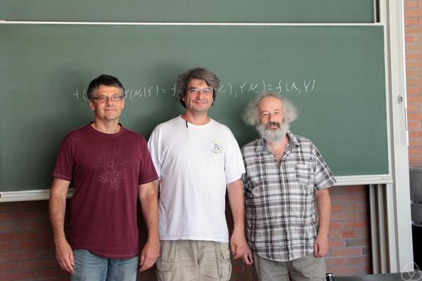

{:style="text-align:center;"}

# Participants

|  Semeon Artamonov*			  |  Sergey Fomin				    |  Brian Mulholland			      |	 Michael Shapiro
|  Karin Baur					  |  Christof Geiss				    |  Nicolas Ovenhouse			      |	 Alexander Shapiro
|  Marco Bertola*				  |  Misha Gekhtman				    |  Valentin Ovsienko			      |	 Daniil Soskin
|  Eric Bucher					  |  Rinat Kedem				    |  Pierre-Guy Plamondon			      |	 Salvatore Stella
|  Yurii Burman*				  |  Boris Khesin				    |  Pavlo Pylyavskyy				      |	 Sergei Tabachnikov
|  Giovanni Cerulli Irelli		  |  Olya Kravchenko			    |  Vladimir Retakh				      |	 Pavel Tumarkin
|  Leonid Chekhov				  |  Sergey Lando				    |  Dylan Rupel		    		      |	 Alek Vainshtein
|  Alex Degtyarev				  |  Bernard Leclerc			    |  Nicolau Saldanha				      |	 Dima Voloshyn
|  Philippe DiFrancesco			  |  John Machacek				    |  Gus Schrader			    	      |	 Harold Williams*
|  Anna Felikson				  |  Sophie Morier-Genoud		    |  Sergey Shadrin*				      |	 Milen Yakimov
|  Vladimir Fock				  |  Kathryn Mulholland		    |  Boris Shapiro

# Schedule
TBA

# Logistics

The conference will take place from the 5th to the 9th of June 2023 at Bellavista
Relax Hotel in Levico Terme. 

For practical reasons all participants should lodge at the conference venue; it
will not be possible to provide refreshments and meals for guests sleeping
elsewhere. The hotel is booked from the 4th to the 9th of June.

[Bellavista Relax Hotel](https://www.bellavistarelax.it/)  
Viale Vittorio Emanuele III, 7  
38056 Levico Terme (TN)  
Tel.:  +39 0461 706136  
Fax:  +39 0461 706474  
email:[bookingoffice@bellavistarelax.it](mailto:bookingoffice@bellavistarelax.it)

# Organizers

- Kathryn Mulholland (University of Notre Dame)
- Nicholas Ovenhouse (Yale University)
- Gus Schrader (Northwestern University)
- Alexander Shapiro (University of Edinburgh)
- Salvatore Stella (Università dell’Aquila)

# Funding

This conference is funded by

- Centro Internazionale per la Ricerca Matematica --- Fondazione Bruno Kessler
- Foundation Compositio Mathematica
- University of Notre Dame
